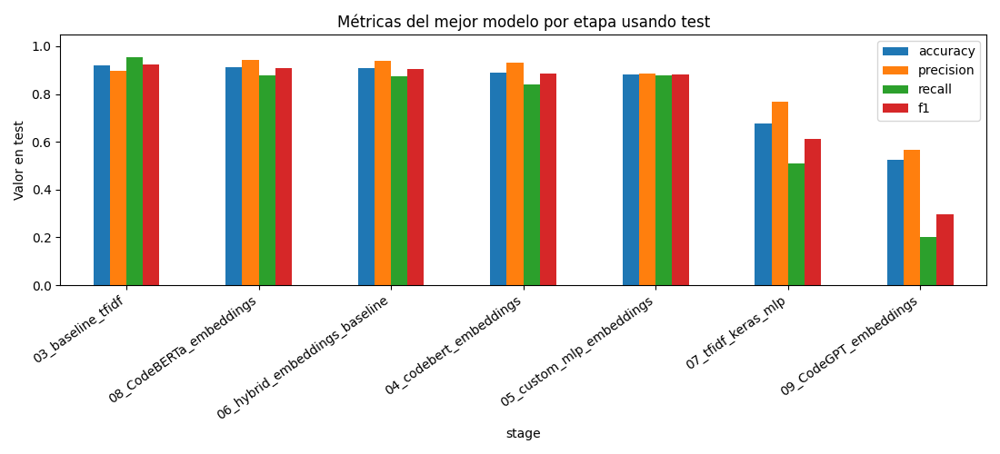
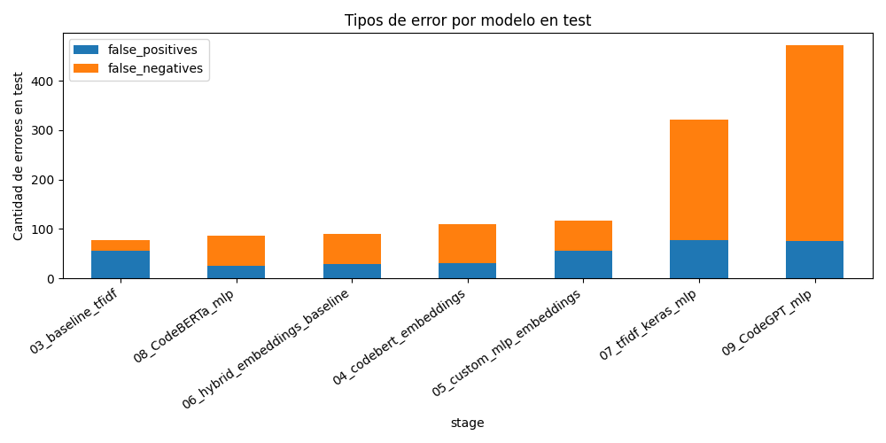
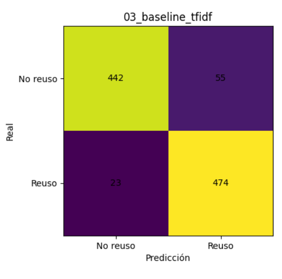

# Deteccion de reuso de codigo con modelos de aprendizaje automatico

## Descripcion general

Este proyecto desarrolla y compara varios modelos para detectar si dos fragmentos de codigo representan **reuso de codigo** o no. En terminos de aprendizaje automatico, el problema se plantea como una **clasificacion binaria**:

- `1`: el par de programas tiene reuso o similitud relevante.
- `0`: el par de programas no presenta reuso.

El flujo completo se trabajo en notebooks numerados. Primero se cargan los codigos fuente, despues se construyen pares de comparacion, se limpian y normalizan los textos, se calculan variables de similitud y finalmente se entrenan distintos modelos. Al final se comparan los resultados para seleccionar el modelo con mejor desempeno general.

## Archivos principales

| Archivo                                            | Proposito                                                                              |
| -------------------------------------------------- | -------------------------------------------------------------------------------------- |
| `01-Preprocesado_de_datos.ipynb`                   | Carga inicial de los archivos de codigo y construccion de pares positivos y negativos. |
| `02-Procesado_del_código.ipynb`                    | Limpieza, normalizacion y generacion de variables de similitud.                        |
| `03-Entrenamiento_modelo_baseline.ipynb`           | Entrenamiento de modelos clasicos con TF-IDF y caracteristicas numericas.              |
| `04-Entreamiento_embeddings.ipynb`                 | Extraccion de embeddings con CodeBERT y entrenamiento de clasificadores tradicionales. |
| `05-Entrenamiento_embeddings_y_red_neuronal.ipynb` | Entrenamiento de una red neuronal MLP usando embeddings de CodeBERT.                   |
| `06-Entrenamiento_embeddings_baseline.ipynb`       | Modelo hibrido que combina embeddings y variables manuales.                            |
| `07_Entrenamiento_TFIDF_MLP.ipynb`                 | Red neuronal MLP usando representacion TF-IDF.                                         |
| `comparation.ipynb`                                | Comparacion final de todos los modelos y seleccion del mejor.                          |

Los datos intermedios y resultados se guardan en:

- `data/processed/`: archivos procesados para entrenamiento, validacion y prueba.
- `data/embeddings/`: vectores generados con CodeBERT.
- `data/models/`: modelos entrenados.
- `data/reports/`: metricas, predicciones y comparaciones.
- `data/reports/figures/`: visualizaciones generadas para el reporte.

## Procesamiento de datos

El procesamiento convierte archivos de codigo fuente en una tabla de pares comparables. Cada fila representa dos programas y una etiqueta que indica si existe reuso.

Primero se leen los archivos originales y se construyen pares positivos a partir de las relaciones conocidas del conjunto de datos. Despues se crean pares negativos, que sirven para que el modelo tambien aprenda ejemplos donde no hay reuso. Esto es importante porque un clasificador necesita observar ambos casos para poder separar las clases.

Luego se realiza limpieza del codigo. En esta etapa se eliminan comentarios, se normaliza el texto y se separa el codigo en tokens. La idea no es compilar los programas, sino representar su estructura textual de manera comparable. Tambien se conservan versiones del codigo segun el tipo de modelo: una version mas compacta para TF-IDF y otra mas cercana al texto original para modelos basados en transformers.

Ademas se calculan variables numericas de similitud:

- `jaccard_norm`: mide la proporcion de tokens compartidos entre dos codigos.
- `token_overlap_norm`: mide el solapamiento de tokens considerando repeticiones.
- `relative_token_count_diff`: mide que tan diferente es la longitud tokenizada entre ambos codigos.

Estas variables no deciden por si solas si hay reuso, pero funcionan como senales utiles. Por ejemplo, dos codigos con muchos tokens en comun suelen tener mayor probabilidad de estar relacionados, aunque tambien puede haber reuso con cambios estructurales o renombramiento de variables.

Los conjuntos compactos usados por los modelos baseline quedaron con:

| Conjunto      | Pares |
| ------------- | ----: |
| Entrenamiento |   176 |
| Validacion    |    44 |
| Prueba        |   994 |

## Modelos desarrollados

### 1. Baseline TF-IDF con modelos clasicos

**Explicacion del modelo desarrollado:**  
Este primer enfoque usa `TF-IDF` para transformar el codigo normalizado en vectores numericos. TF-IDF asigna mayor peso a los tokens que son importantes dentro de un documento, pero que no aparecen de forma excesiva en todos los documentos. Con esta representacion se entrenaron tres clasificadores:

- Regresion logistica.
- SVM lineal.
- Random Forest con variables simples.

El mejor modelo de este grupo fue **Linear SVM**. Este modelo busca una frontera lineal que separe pares con reuso y pares sin reuso. Es adecuado cuando se trabaja con vectores TF-IDF, porque estos suelen tener muchas dimensiones y ser dispersos.

**Razones de seleccion:**  
Se eligio como baseline porque es un metodo simple, interpretable y rapido de entrenar. Antes de usar modelos mas complejos, era necesario tener una referencia clara de desempeno. TF-IDF con SVM es una alternativa comun en problemas de clasificacion de texto, por lo que sirve como punto de comparacion fuerte.

En validacion, este modelo obtuvo el mejor resultado inicial:

| Modelo                        | Accuracy | Precision | Recall | F1-score |
| ----------------------------- | -------: | --------: | -----: | -------: |
| Linear SVM                    |   0.9318 |    0.8800 | 1.0000 |   0.9362 |
| Logistic Regression           |   0.9091 |    0.8750 | 0.9545 |   0.9130 |
| Random Forest Simple Features |   0.8636 |    0.8636 | 0.8636 |   0.8636 |

### 2. Embeddings CodeBERT con clasificadores tradicionales

**Explicacion del modelo desarrollado:**  
Este modelo usa `microsoft/codebert-base`, un transformer preentrenado para entender codigo y lenguaje natural relacionado con codigo. CodeBERT convierte cada fragmento de codigo en un vector numerico llamado embedding. Despues, para cada par de codigos, se combinan sus embeddings y se agregan medidas como similitud coseno. Sobre estas representaciones se entrenaron clasificadores tradicionales:

- Random Forest.
- Regresion logistica.
- SVM lineal.

El mejor de este grupo fue **Embedding Random Forest**.

**Razones de seleccion:**  
Se eligio CodeBERT porque el problema no es solamente comparar palabras iguales. Dos programas pueden ser similares aunque cambien nombres de variables, orden de instrucciones o detalles de implementacion. Un transformer preentrenado puede capturar relaciones semanticas mas ricas que TF-IDF. Se uso como extractor de caracteristicas, sin reentrenar sus pesos, para reducir costo computacional y evitar sobreajuste con un conjunto de entrenamiento pequeno.

Resultados en validacion:

| Modelo                        | Accuracy | Precision | Recall | F1-score |
| ----------------------------- | -------: | --------: | -----: | -------: |
| Embedding Random Forest       |   0.9091 |    0.9091 | 0.9091 |   0.9091 |
| Embedding Logistic Regression |   0.8409 |    0.8000 | 0.9091 |   0.8511 |
| Embedding Linear SVM          |   0.8409 |    0.8000 | 0.9091 |   0.8511 |

### 3. MLP sobre embeddings de CodeBERT

**Explicacion del modelo desarrollado:**  
Este enfoque usa una red neuronal tipo **MLP** sobre los embeddings generados con CodeBERT. Una MLP es una red neuronal feed-forward formada por capas densas. En este caso, recibe vectores numericos que representan ambos codigos y aprende una funcion de clasificacion binaria.

Tambien se ajusto un umbral de decision. En lugar de clasificar como positivo solamente cuando la probabilidad es mayor a `0.50`, se evaluaron varios umbrales y el mejor resultado de validacion se obtuvo con umbral aproximado de `0.40`.

**Razones de seleccion:**  
Se probo una MLP porque puede aprender combinaciones no lineales entre las caracteristicas de los embeddings. Esto podria ayudar cuando la relacion entre dos codigos no se separa bien con una frontera lineal. Sin embargo, al tener pocos ejemplos de entrenamiento, una red neuronal tambien puede ser mas sensible al sobreajuste.

Resultado principal en validacion:

| Modelo              | Accuracy | Precision | Recall | F1-score | Umbral |
| ------------------- | -------: | --------: | -----: | -------: | -----: |
| Custom MLP CodeBERT |   0.8636 |    0.8333 | 0.9091 |   0.8696 |   0.40 |

### 4. Modelo hibrido: embeddings + variables manuales

**Explicacion del modelo desarrollado:**  
El modelo hibrido combina dos tipos de informacion:

- Embeddings de CodeBERT, que capturan informacion semantica del codigo.
- Variables manuales como Jaccard, solapamiento de tokens y diferencia relativa de longitud.

Con esta representacion combinada se entrenaron varios clasificadores. El mejor fue **Hybrid Random Forest**.

**Razones de seleccion:**  
Este modelo se eligio porque aprovecha las ventajas de dos enfoques. Los embeddings aportan informacion profunda aprendida por un transformer, mientras que las variables manuales agregan senales directas y faciles de interpretar sobre similitud textual. Random Forest es util en este caso porque puede combinar variables de distinto tipo y capturar relaciones no lineales sin requerir una gran cantidad de ajuste.

Resultados en validacion:

| Modelo                     | Accuracy | Precision | Recall | F1-score |
| -------------------------- | -------: | --------: | -----: | -------: |
| Hybrid Random Forest       |   0.9091 |    0.9091 | 0.9091 |   0.9091 |
| Hybrid Logistic Regression |   0.8636 |    0.8333 | 0.9091 |   0.8696 |
| Hybrid Linear SVM          |   0.8409 |    0.8000 | 0.9091 |   0.8511 |
| Hybrid Extra Trees         |   0.8409 |    0.8947 | 0.7727 |   0.8293 |

### 5. MLP con TF-IDF

**Explicacion del modelo desarrollado:**  
Este modelo usa una red neuronal MLP implementada con Keras, pero en lugar de embeddings de CodeBERT utiliza vectores TF-IDF. La mejor configuracion registrada uso capas densas con regularizacion y dropout. Tambien se busco un umbral de decision, y el mejor resultado guardado uso umbral `0.45`.

**Razones de seleccion:**  
Se probo para comparar si una red neuronal podia mejorar el baseline clasico usando la misma representacion TF-IDF. La ventaja esperada era que la MLP pudiera aprender relaciones no lineales. Sin embargo, con pocos datos, el desempeno no supero a los modelos clasicos ni al modelo hibrido.

Resultado principal en validacion:

| Modelo           | Accuracy | Precision | Recall | F1-score | Umbral |
| ---------------- | -------: | --------: | -----: | -------: | -----: |
| TF-IDF Keras MLP |   0.8636 |    0.7857 | 1.0000 |   0.8800 |   0.45 |

### 6. Modelo CodeBERTa

**Explicacion del modelo desarrollado:**  
- Embeddings de CodeBERTa, usando el tokenizer BPE entrenado y otorgado por Hugging Face.
- Variables manuales como Jaccard, solapamiento de tokens y diferencia relativa de longitud.

Con esta representacion combinada se entrenaron varios clasificadores. El mejor fue **Embedding Logistic Regression**.

Resultados en validacion:
| Modelo                        | Accuracy | Precision | Recall | F1-score |
| ----------------------------- | -------: | --------: | -----: | -------: |
| Embedding Logistic Regression |   0.9545 |    0.9545 | 0.9545 |   0.9545 |
| Embedding Linear SVM          |   0.9545 |    0.9545 | 0.9545 |   0.9545 |
| Embedding Random Forest       |   0.9318 |    0.9524 | 0.9091 |   0.9302 |

### 7. Modelo CodeGPT

**Explicacion del modelo desarrollado:**  
- Embeddings de CodeGPT, usando el tokenizer BPE entrenado y otorgado por Hugging Face.
- Variables manuales como Jaccard, solapamiento de tokens y diferencia relativa de longitud.

Con esta representacion combinada se entrenaron varios clasificadores. El mejor fue **Embedding Logistic Regression**.

Resultados en validacion:
| Modelo                        | Accuracy | Precision | Recall | F1-score |
| ----------------------------- | -------: | --------: | -----: | -------: |
| Embedding Logistic Regression |   0.8409 |    0.8261 | 0.8636 |   0.8444 |
| Embedding Linear SVM          |   0.8182 |    0.7917 | 0.8636 |   0.8261 |
| Embedding Random Forest       |   0.8182 |    0.7917 | 0.8636 |   0.8261 |

## Resultados principales

Aunque en validacion el mejor modelo fue el **Linear SVM con TF-IDF**, la evaluacion final en el conjunto de prueba mostro que el mejor desempeno general fue del **modelo hibrido con Random Forest**.

| Modelo                  | Familia                       | Accuracy | Precision | Recall | F1-score |  TN |  FP |  FN |  TP |
| ----------------------- | ----------------------------- | -------: | --------: | -----: | -------: | --: | --: | --: | --: |
| Hybrid Random Forest    | Hibrido embeddings + baseline |   0.9155 |    0.9640 | 0.8632 |   0.9108 | 481 |  16 |  68 | 429 |
| Embedding Random Forest | Embeddings CodeBERT           |   0.9024 |    0.9587 | 0.8410 |   0.8960 | 479 |  18 |  79 | 418 |
| Linear SVM              | TF-IDF clasico                |   0.8753 |    0.8348 | 0.9356 |   0.8824 | 405 |  92 |  32 | 465 |
| Custom MLP CodeBERT     | MLP embeddings                |   0.8793 |    0.8793 | 0.8793 |   0.8793 | 437 |  60 |  60 | 437 |
| TF-IDF Keras MLP        | MLP TF-IDF                    |   0.5865 |    0.5482 | 0.9839 |   0.7041 |  94 | 403 |   8 | 489 |

El modelo hibrido obtuvo el F1-score mas alto (`0.9108`) y tambien la mejor exactitud (`0.9155`). Su precision fue muy alta (`0.9640`), lo que significa que cuando predice reuso, normalmente acierta. Su recall fue de `0.8632`, por lo que todavia deja algunos casos positivos sin detectar, pero mantiene un equilibrio fuerte entre precision y recuperacion.

En comparacion, el SVM con TF-IDF tuvo un recall mas alto (`0.9356`), pero genero mas falsos positivos. Esto significa que detecta muchos casos de reuso, pero tambien clasifica como reuso varios pares que realmente no lo son. Para este problema, el modelo hibrido resulta mas equilibrado porque reduce mucho los falsos positivos sin perder demasiado recall.

## Visualizacion de resultados

### Comparacion de metricas

Esta grafica compara accuracy, precision, recall y F1-score en el conjunto de prueba. Se observa que el modelo hibrido tiene el mejor F1-score general, mientras que el modelo TF-IDF Keras MLP tiene recall y presicion más alto.

### Errores por modelo

La grafica de errores muestra cuantos falsos positivos y falsos negativos produjo cada modelo. El modelo TF-IDF baseline fue el que tuvo menor cantidad total de errores en prueba: `78` errores, formados por `55` falsos positivos y `23` falsos negativos.

### Matriz de confusion del mejor modelo

La matriz de confusion del modelo hibrido muestra:

- `442` verdaderos negativos: pares sin reuso clasificados correctamente.
- `474` verdaderos positivos: pares con reuso clasificados correctamente.
- `23` falsos positivos: pares sin reuso clasificados como reuso.
- `55` falsos negativos: pares con reuso que el modelo no detecto.

## Conclusiones

El proyecto demuestra que combinar representaciones profundas con caracteristicas manuales produce el mejor resultado. CodeBERT aporta una representacion semantica del codigo, mientras que las metricas manuales ayudan a capturar similitud directa entre tokens.

El baseline con TF-IDF y SVM fue el mejor modelo, especialmente en validacion, lo cual confirma que los metodos clasicos siguen siendo utiles cuando el conjunto de datos es pequeño..

Como trabajo futuro, se podria ampliar el conjunto de entrenamiento, probar ajuste fino de CodeBERT, revisar los falsos negativos del modelo hibrido y usar validacion cruzada para obtener una estimacion mas estable del desempeno.